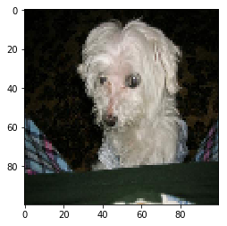
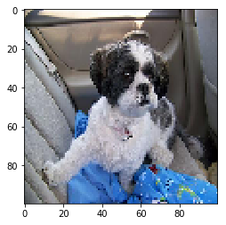

## Import Dependencies

### Data Science Libraries


```python
%matplotlib inline
import numpy as np
import pandas as pd
import matplotlib.pyplot as plt

from tqdm import tqdm
from sklearn.model_selection import train_test_split
from sklearn.preprocessing import LabelEncoder
```

### General Dependencies


```python
import os
import random
```

### Keras-specific Dependencies


```python
import keras

from keras.preprocessing import image
from keras.models import Sequential
from keras.layers import Dense, Dropout, Flatten
from keras.layers import Conv2D, MaxPooling2D
from keras.optimizers import SGD
from keras.utils import to_categorical
```

    Using TensorFlow backend.


## Split the dataset into training and testing

### Create key-value pair mapping for Dog ID and breed


```python
# Create separate lists for dog ids and dog breeds
root = "/Users/krithika/Desktop/GitHub Repositories/The-Pup-Files/"

dog_breeds = ['Chihuahua', 'Japanese Spaniel', 'Maltese', 'Pekinese', 'Shih Tzu', 'Blenheim Spaniel', 'Papillion',
              'Toy Terrier', 'Rhodesian Ridgeback', 'Afghan Hound', 'Basset Hound', 'Beagle', 'Bloodhound',
              'Bluetick', 'Black And Tan Coonhound', 'Walker Hound', 'English Foxhound', 'Redbone', 'Borzoi',
              'Irish Wolfhound', 'Italian Greyhound', 'Whippet', 'Ibizan Hound', 'Norwegian Elkhound', 'Otterhound',
              'Saluki', 'Scottish Deerhound', 'Weimaraner', 'Staffordshire Bullterrier', 'American Staffordshire Terrier',
              'Bedlington Terrier', 'Border Terrier', 'Kerry Blue Terrier', 'Irish Terrier', 'Norfolk Terrier',
              'Norwich Terrier', 'Yorkshire Terrier', 'Wirehaired Fox Terrier', 'Lakeland Terrier', 'Sealyham Terrier',
              'Airedale', 'Cairn', 'Australian Terrier', 'Dandie Dinmont', 'Boston Bulldog', 'Miniature Schnauzer',
              'Giant Schnauzer', 'Standard Schnauzer', 'Scotch Terrier', 'Tibetan Terrier', 'Silky Terrier',
              'Soft Coated Wheaten Terrier', 'West Highland White Terrier', 'Lhasa Apso', 'Flat Coated Retriever',
              'Curly Coated Retriever', 'Golden Retriever', 'Labrador Retriever', 'Chesapeake Bay Retriever',
              'German Short Haired Pointer', 'Vizsla', 'English Setter', 'Irish Setter', 'Gordon Setter',
              'Brittany Spaniel', 'Clumber', 'English Springer', 'Welsh Springer Spaniel', 'Cocker Spaniel', 'Sussex Spaniel',
              'Irish Water Spaniel', 'Kuvasz', 'Schipperke', 'Groenendael', 'Malinois', 'Briard', 'Kelpie', 'Komondor',
              'Old English Sheepdog', 'Shetland Sheepdog', 'Collie', 'Border Collie', 'Bouvier Des Flandres', 'Rottweiler',
              'German Shephard', 'Doberman', 'Miniature Pinscher', 'Great Swiss Mountain Dog', 'Bernese Mountain Dog',
              'Appenzeller', 'EntleBucher', 'Boxer', 'Bull Mastiff', 'Tibetan Mastiff', 'French Bulldog', 'Great Dane',
              'Saint Bernard', 'Eskimo Dog', 'Alaskan Malamute', 'Siberian Husky', 'Affenpinscher', 'Basenji', 'Pug',
              'Leonberg', 'Newfoundland Terrier', 'Great Pyrenees', 'Samoyed', 'Pomeranian', 'Chow', 'Keeshond',
              'Brabancon Griffon', 'Pembroke Corgi', 'Cardigan Corgi', 'Toy Poodle', 'Miniature Poodle', 'Standard Poodle',
              'Mexican Hairless', 'Dingo', 'Dhole', 'African Hunting Dog']

dog_ids = []

folder_names = sorted(os.listdir(root + "Dataset/Images/"))
folder_names.remove('.DS_Store')

for fpath in folder_names:
    dog_ids.append(fpath.split("-")[0])

dog_ids_breeds = dict(zip(dog_ids, dog_breeds))

for key, value in dog_ids_breeds.items():
    print(f"{key}: {value}")
```

    n02085620: Chihuahua
    n02085782: Japanese Spaniel
    n02085936: Maltese
    n02086079: Pekinese
    n02086240: Shih Tzu
    n02086646: Blenheim Spaniel
    n02086910: Papillion
    n02087046: Toy Terrier
    n02087394: Rhodesian Ridgeback
    n02088094: Afghan Hound
    n02088238: Basset Hound
    n02088364: Beagle
    n02088466: Bloodhound
    n02088632: Bluetick
    n02089078: Black And Tan Coonhound
    n02089867: Walker Hound
    n02089973: English Foxhound
    n02090379: Redbone
    n02090622: Borzoi
    n02090721: Irish Wolfhound
    n02091032: Italian Greyhound
    n02091134: Whippet
    n02091244: Ibizan Hound
    n02091467: Norwegian Elkhound
    n02091635: Otterhound
    n02091831: Saluki
    n02092002: Scottish Deerhound
    n02092339: Weimaraner
    n02093256: Staffordshire Bullterrier
    n02093428: American Staffordshire Terrier
    n02093647: Bedlington Terrier
    n02093754: Border Terrier
    n02093859: Kerry Blue Terrier
    n02093991: Irish Terrier
    n02094114: Norfolk Terrier
    n02094258: Norwich Terrier
    n02094433: Yorkshire Terrier
    n02095314: Wirehaired Fox Terrier
    n02095570: Lakeland Terrier
    n02095889: Sealyham Terrier
    n02096051: Airedale
    n02096177: Cairn
    n02096294: Australian Terrier
    n02096437: Dandie Dinmont
    n02096585: Boston Bulldog
    n02097047: Miniature Schnauzer
    n02097130: Giant Schnauzer
    n02097209: Standard Schnauzer
    n02097298: Scotch Terrier
    n02097474: Tibetan Terrier
    n02097658: Silky Terrier
    n02098105: Soft Coated Wheaten Terrier
    n02098286: West Highland White Terrier
    n02098413: Lhasa Apso
    n02099267: Flat Coated Retriever
    n02099429: Curly Coated Retriever
    n02099601: Golden Retriever
    n02099712: Labrador Retriever
    n02099849: Chesapeake Bay Retriever
    n02100236: German Short Haired Pointer
    n02100583: Vizsla
    n02100735: English Setter
    n02100877: Irish Setter
    n02101006: Gordon Setter
    n02101388: Brittany Spaniel
    n02101556: Clumber
    n02102040: English Springer
    n02102177: Welsh Springer Spaniel
    n02102318: Cocker Spaniel
    n02102480: Sussex Spaniel
    n02102973: Irish Water Spaniel
    n02104029: Kuvasz
    n02104365: Schipperke
    n02105056: Groenendael
    n02105162: Malinois
    n02105251: Briard
    n02105412: Kelpie
    n02105505: Komondor
    n02105641: Old English Sheepdog
    n02105855: Shetland Sheepdog
    n02106030: Collie
    n02106166: Border Collie
    n02106382: Bouvier Des Flandres
    n02106550: Rottweiler
    n02106662: German Shephard
    n02107142: Doberman
    n02107312: Miniature Pinscher
    n02107574: Great Swiss Mountain Dog
    n02107683: Bernese Mountain Dog
    n02107908: Appenzeller
    n02108000: EntleBucher
    n02108089: Boxer
    n02108422: Bull Mastiff
    n02108551: Tibetan Mastiff
    n02108915: French Bulldog
    n02109047: Great Dane
    n02109525: Saint Bernard
    n02109961: Eskimo Dog
    n02110063: Alaskan Malamute
    n02110185: Siberian Husky
    n02110627: Affenpinscher
    n02110806: Basenji
    n02110958: Pug
    n02111129: Leonberg
    n02111277: Newfoundland Terrier
    n02111500: Great Pyrenees
    n02111889: Samoyed
    n02112018: Pomeranian
    n02112137: Chow
    n02112350: Keeshond
    n02112706: Brabancon Griffon
    n02113023: Pembroke Corgi
    n02113186: Cardigan Corgi
    n02113624: Toy Poodle
    n02113712: Miniature Poodle
    n02113799: Standard Poodle
    n02113978: Mexican Hairless
    n02115641: Dingo
    n02115913: Dhole
    n02116738: African Hunting Dog


### Display number of images per breed


```python
for file in folder_names:
    length = len(os.listdir(root + "/Dataset/Images/" + file))
    print(f"{file}: {length}")
```

    n02085620-Chihuahua: 152
    n02085782-Japanese_spaniel: 185
    n02085936-Maltese_dog: 252
    n02086079-Pekinese: 149
    n02086240-Shih-Tzu: 214
    n02086646-Blenheim_spaniel: 188
    n02086910-papillon: 196
    n02087046-toy_terrier: 172
    n02087394-Rhodesian_ridgeback: 172
    n02088094-Afghan_hound: 239
    n02088238-basset: 175
    n02088364-beagle: 195
    n02088466-bloodhound: 187
    n02088632-bluetick: 171
    n02089078-black-and-tan_coonhound: 159
    n02089867-Walker_hound: 153
    n02089973-English_foxhound: 157
    n02090379-redbone: 148
    n02090622-borzoi: 151
    n02090721-Irish_wolfhound: 218
    n02091032-Italian_greyhound: 182
    n02091134-whippet: 187
    n02091244-Ibizan_hound: 188
    n02091467-Norwegian_elkhound: 196
    n02091635-otterhound: 151
    n02091831-Saluki: 200
    n02092002-Scottish_deerhound: 232
    n02092339-Weimaraner: 160
    n02093256-Staffordshire_bullterrier: 155
    n02093428-American_Staffordshire_terrier: 164
    n02093647-Bedlington_terrier: 182
    n02093754-Border_terrier: 172
    n02093859-Kerry_blue_terrier: 179
    n02093991-Irish_terrier: 169
    n02094114-Norfolk_terrier: 172
    n02094258-Norwich_terrier: 185
    n02094433-Yorkshire_terrier: 164
    n02095314-wire-haired_fox_terrier: 157
    n02095570-Lakeland_terrier: 197
    n02095889-Sealyham_terrier: 202
    n02096051-Airedale: 202
    n02096177-cairn: 197
    n02096294-Australian_terrier: 196
    n02096437-Dandie_Dinmont: 180
    n02096585-Boston_bull: 182
    n02097047-miniature_schnauzer: 154
    n02097130-giant_schnauzer: 157
    n02097209-standard_schnauzer: 155
    n02097298-Scotch_terrier: 158
    n02097474-Tibetan_terrier: 206
    n02097658-silky_terrier: 183
    n02098105-soft-coated_wheaten_terrier: 156
    n02098286-West_Highland_white_terrier: 169
    n02098413-Lhasa: 186
    n02099267-flat-coated_retriever: 152
    n02099429-curly-coated_retriever: 151
    n02099601-golden_retriever: 150
    n02099712-Labrador_retriever: 171
    n02099849-Chesapeake_Bay_retriever: 167
    n02100236-German_short-haired_pointer: 152
    n02100583-vizsla: 154
    n02100735-English_setter: 161
    n02100877-Irish_setter: 155
    n02101006-Gordon_setter: 153
    n02101388-Brittany_spaniel: 152
    n02101556-clumber: 150
    n02102040-English_springer: 159
    n02102177-Welsh_springer_spaniel: 150
    n02102318-cocker_spaniel: 159
    n02102480-Sussex_spaniel: 151
    n02102973-Irish_water_spaniel: 150
    n02104029-kuvasz: 150
    n02104365-schipperke: 154
    n02105056-groenendael: 150
    n02105162-malinois: 150
    n02105251-briard: 152
    n02105412-kelpie: 153
    n02105505-komondor: 154
    n02105641-Old_English_sheepdog: 169
    n02105855-Shetland_sheepdog: 157
    n02106030-collie: 153
    n02106166-Border_collie: 150
    n02106382-Bouvier_des_Flandres: 150
    n02106550-Rottweiler: 152
    n02106662-German_shepherd: 152
    n02107142-Doberman: 150
    n02107312-miniature_pinscher: 184
    n02107574-Greater_Swiss_Mountain_dog: 168
    n02107683-Bernese_mountain_dog: 218
    n02107908-Appenzeller: 151
    n02108000-EntleBucher: 202
    n02108089-boxer: 151
    n02108422-bull_mastiff: 156
    n02108551-Tibetan_mastiff: 152
    n02108915-French_bulldog: 159
    n02109047-Great_Dane: 156
    n02109525-Saint_Bernard: 170
    n02109961-Eskimo_dog: 150
    n02110063-malamute: 178
    n02110185-Siberian_husky: 192
    n02110627-affenpinscher: 150
    n02110806-basenji: 209
    n02110958-pug: 200
    n02111129-Leonberg: 210
    n02111277-Newfoundland: 195
    n02111500-Great_Pyrenees: 213
    n02111889-Samoyed: 218
    n02112018-Pomeranian: 219
    n02112137-chow: 196
    n02112350-keeshond: 158
    n02112706-Brabancon_griffon: 153
    n02113023-Pembroke: 181
    n02113186-Cardigan: 155
    n02113624-toy_poodle: 151
    n02113712-miniature_poodle: 155
    n02113799-standard_poodle: 159
    n02113978-Mexican_hairless: 155
    n02115641-dingo: 156
    n02115913-dhole: 150
    n02116738-African_hunting_dog: 169


### Create training images dataframe


```python
# Pull 80% of images per breed for training
train_file_list = []
train_labels = []

folder_names = sorted(os.listdir(root + "/Dataset/Images/"))
folder_names.remove('.DS_Store')

for folder_path in folder_names:
    file_names = sorted(os.listdir(root + "/Dataset/Images/" + folder_path))
    random.shuffle(file_names)
    n = int(len(file_names) * 0.8)
    file_names = np.random.choice(file_names, n)
    for filepath in file_names:
        d_id = filepath.split("_")[0]
        train_file_list.append(folder_path + "/" + filepath)
        train_labels.append(dog_ids_breeds[d_id])

# Create a dataframe with filepaths and breed labels
train_df = pd.DataFrame({"filepath": train_file_list, "label": train_labels})
train_df.head()
```
<table border="1" class="dataframe">
  <thead>
    <tr style="text-align: right;">
      <th></th>
      <th>filepath</th>
      <th>label</th>
    </tr>
  </thead>
  <tbody>
    <tr>
      <th>0</th>
      <td>n02085620-Chihuahua/n02085620_13383.jpg</td>
      <td>Chihuahua</td>
    </tr>
    <tr>
      <th>1</th>
      <td>n02085620-Chihuahua/n02085620_11258.jpg</td>
      <td>Chihuahua</td>
    </tr>
    <tr>
      <th>2</th>
      <td>n02085620-Chihuahua/n02085620_4016.jpg</td>
      <td>Chihuahua</td>
    </tr>
    <tr>
      <th>3</th>
      <td>n02085620-Chihuahua/n02085620_3593.jpg</td>
      <td>Chihuahua</td>
    </tr>
    <tr>
      <th>4</th>
      <td>n02085620-Chihuahua/n02085620_5713.jpg</td>
      <td>Chihuahua</td>
    </tr>
  </tbody>
</table>
</div>


### Create testing images dataframe


```python
# Pull 20% of images per breed for testing
test_file_list = []

folder_names = sorted(os.listdir(root + "/Dataset/Images/"))
folder_names.remove('.DS_Store')

for folder_path in folder_names:
    file_names = sorted(os.listdir(root + "/Dataset/Images/" + folder_path))
    random.shuffle(file_names)
    n = int(len(file_names) * 0.2)
    file_names = np.random.choice(file_names, n)
    for filepath in file_names:
        test_file_list.append(folder_path + "/" + filepath)

# Create a dataframe with filepaths and breed labels
test_df = pd.DataFrame({"filepath": test_file_list})
test_df.head()

# all_file_names = sorted(os.listdir(root + "/Dataset/Images/" + folder_path))
# file_names = [file for file in all_file_names if file not in train_file_list]
```
<table border="1" class="dataframe">
  <thead>
    <tr style="text-align: right;">
      <th></th>
      <th>filepath</th>
    </tr>
  </thead>
  <tbody>
    <tr>
      <th>0</th>
      <td>n02085620-Chihuahua/n02085620_4515.jpg</td>
    </tr>
    <tr>
      <th>1</th>
      <td>n02085620-Chihuahua/n02085620_3208.jpg</td>
    </tr>
    <tr>
      <th>2</th>
      <td>n02085620-Chihuahua/n02085620_574.jpg</td>
    </tr>
    <tr>
      <th>3</th>
      <td>n02085620-Chihuahua/n02085620_730.jpg</td>
    </tr>
    <tr>
      <th>4</th>
      <td>n02085620-Chihuahua/n02085620_3033.jpg</td>
    </tr>
  </tbody>
</table>
</div>


### Create array representations for all training images


```python
os.chdir(root + "/Dataset/Images/")
train_images = []

for i in tqdm(range(train_df.shape[0])):
    img = image.load_img(train_df['filepath'][i], target_size=(100, 100, 3), \
            grayscale=False)
    img = image.img_to_array(img)
    img = img / 255
    train_images.append(img)

X_train = np.array(train_images)    
```

    100%|██████████| 16418/16418 [01:16<00:00, 215.94it/s]


### Create array representations for all testing images


```python
os.chdir(root + "/Dataset/Images/")
test_images = []

for i in tqdm(range(test_df.shape[0])):
    img = image.load_img(test_df['filepath'][i], target_size=(100, 100, 3), \
            grayscale=False)
    img = image.img_to_array(img)
    img = img / 255
    test_images.append(img)

X_test = np.array(test_images)
```

    100%|██████████| 4072/4072 [00:21<00:00, 186.34it/s]


### Create categories and one-hot encoded labels


```python
y_train = train_df["label"].values
unique_labels = []
unique_categories = []

# Step-1: Perform Label Encoding
label_encoder = LabelEncoder()
label_encoder.fit(y_train)
encoded_y = label_encoder.transform(y_train)

for label, encoded_label in zip(y_train, encoded_y):
    if label not in unique_labels:
        unique_labels.append(label)
    if encoded_label not in unique_categories:
        unique_categories.append(encoded_label)

# Create a dictionary mapping encoded labels to dog breeds
dog_labels_categories = dict(zip(unique_categories, unique_labels))

y_train = encoded_y

# Step-2: Perform One-Hot Encoding
y_train = to_categorical(y_train)
```

### Display the mapping from dog breed to label-encoded value


```python
for key, value in dog_labels_categories.items():
    print(f"{key}: {value}")
```

    30: Chihuahua
    62: Japanese Spaniel
    73: Maltese
    85: Pekinese
    100: Shih Tzu
    14: Blenheim Spaniel
    84: Papillion
    111: Toy Terrier
    90: Rhodesian Ridgeback
    1: Afghan Hound
    9: Basset Hound
    10: Beagle
    15: Bloodhound
    16: Bluetick
    13: Black And Tan Coonhound
    113: Walker Hound
    40: English Foxhound
    89: Redbone
    19: Borzoi
    60: Irish Wolfhound
    61: Italian Greyhound
    117: Whippet
    56: Ibizan Hound
    80: Norwegian Elkhound
    83: Otterhound
    93: Saluki
    97: Scottish Deerhound
    114: Weimaraner
    104: Staffordshire Bullterrier
    5: American Staffordshire Terrier
    11: Bedlington Terrier
    18: Border Terrier
    65: Kerry Blue Terrier
    58: Irish Terrier
    79: Norfolk Terrier
    81: Norwich Terrier
    119: Yorkshire Terrier
    118: Wirehaired Fox Terrier
    69: Lakeland Terrier
    98: Sealyham Terrier
    3: Airedale
    27: Cairn
    7: Australian Terrier
    36: Dandie Dinmont
    20: Boston Bulldog
    77: Miniature Schnauzer
    49: Giant Schnauzer
    106: Standard Schnauzer
    96: Scotch Terrier
    109: Tibetan Terrier
    102: Silky Terrier
    103: Soft Coated Wheaten Terrier
    116: West Highland White Terrier
    71: Lhasa Apso
    45: Flat Coated Retriever
    35: Curly Coated Retriever
    50: Golden Retriever
    68: Labrador Retriever
    29: Chesapeake Bay Retriever
    48: German Short Haired Pointer
    112: Vizsla
    41: English Setter
    57: Irish Setter
    51: Gordon Setter
    25: Brittany Spaniel
    32: Clumber
    42: English Springer
    115: Welsh Springer Spaniel
    33: Cocker Spaniel
    107: Sussex Spaniel
    59: Irish Water Spaniel
    67: Kuvasz
    95: Schipperke
    55: Groenendael
    72: Malinois
    24: Briard
    64: Kelpie
    66: Komondor
    82: Old English Sheepdog
    99: Shetland Sheepdog
    34: Collie
    17: Border Collie
    21: Bouvier Des Flandres
    91: Rottweiler
    47: German Shephard
    39: Doberman
    75: Miniature Pinscher
    54: Great Swiss Mountain Dog
    12: Bernese Mountain Dog
    6: Appenzeller
    43: EntleBucher
    22: Boxer
    26: Bull Mastiff
    108: Tibetan Mastiff
    46: French Bulldog
    52: Great Dane
    92: Saint Bernard
    44: Eskimo Dog
    4: Alaskan Malamute
    101: Siberian Husky
    0: Affenpinscher
    8: Basenji
    88: Pug
    70: Leonberg
    78: Newfoundland Terrier
    53: Great Pyrenees
    94: Samoyed
    87: Pomeranian
    31: Chow
    63: Keeshond
    23: Brabancon Griffon
    86: Pembroke Corgi
    28: Cardigan Corgi
    110: Toy Poodle
    76: Miniature Poodle
    105: Standard Poodle
    74: Mexican Hairless
    38: Dingo
    37: Dhole
    2: African Hunting Dog


### Display the shape of train and test variables


```python
print(X_train.shape)
print(y_train.shape)
print(X_test.shape)
```

    (16418, 100, 100, 3)
    (16418, 120)
    (4072, 100, 100, 3)


## Build the Model

### Define the model structure


```python
model = Sequential()

model.add(Conv2D(32, (3, 3), activation='relu', input_shape=(100, 100, 3)))
model.add(Conv2D(32, (3, 3), activation='relu'))
model.add(MaxPooling2D(pool_size=(2, 2)))
model.add(Dropout(0.25))

model.add(Conv2D(64, (3, 3), activation='relu'))
model.add(Conv2D(64, (3, 3), activation='relu'))
model.add(MaxPooling2D(pool_size=(2, 2)))
model.add(Dropout(0.25))

model.add(Flatten())
model.add(Dense(256, activation='relu'))
model.add(Dropout(0.5))
model.add(Dense(120, activation='softmax'))

sgd = SGD(lr=0.01, decay=1e-6, momentum=0.9, nesterov=True)
```

    WARNING:tensorflow:From /anaconda3/lib/python3.7/site-packages/tensorflow/python/framework/op_def_library.py:263: colocate_with (from tensorflow.python.framework.ops) is deprecated and will be removed in a future version.
    Instructions for updating:
    Colocations handled automatically by placer.
    WARNING:tensorflow:From /anaconda3/lib/python3.7/site-packages/keras/backend/tensorflow_backend.py:3445: calling dropout (from tensorflow.python.ops.nn_ops) with keep_prob is deprecated and will be removed in a future version.
    Instructions for updating:
    Please use `rate` instead of `keep_prob`. Rate should be set to `rate = 1 - keep_prob`.


### Compile the model


```python
model.compile(loss='categorical_crossentropy',
              optimizer='sgd',
              metrics=['accuracy'])
```

### Train the model


```python
# Fit (train) the model
model.fit(
    X_train,
    y_train,
    batch_size=32,
    epochs=25
)
```

    WARNING:tensorflow:From /anaconda3/lib/python3.7/site-packages/tensorflow/python/ops/math_ops.py:3066: to_int32 (from tensorflow.python.ops.math_ops) is deprecated and will be removed in a future version.
    Instructions for updating:
    Use tf.cast instead.
    Epoch 1/25
    16418/16418 [==============================] - 464s 28ms/step - loss: 4.7870 - acc: 0.0086
    Epoch 2/25
    16418/16418 [==============================] - 446s 27ms/step - loss: 4.7789 - acc: 0.0135
    Epoch 3/25
    16418/16418 [==============================] - 451s 27ms/step - loss: 4.7523 - acc: 0.0147
    Epoch 4/25
    16418/16418 [==============================] - 446s 27ms/step - loss: 4.7017 - acc: 0.0214
    Epoch 5/25
    16418/16418 [==============================] - 447s 27ms/step - loss: 4.6536 - acc: 0.0279
    Epoch 6/25
    16418/16418 [==============================] - 449s 27ms/step - loss: 4.5961 - acc: 0.0314
    Epoch 7/25
    16418/16418 [==============================] - 446s 27ms/step - loss: 4.5429 - acc: 0.0381
    Epoch 8/25
    16418/16418 [==============================] - 479s 29ms/step - loss: 4.4774 - acc: 0.0431
    Epoch 9/25
    16418/16418 [==============================] - 561s 34ms/step - loss: 4.3951 - acc: 0.0527
    Epoch 10/25
    16418/16418 [==============================] - 562s 34ms/step - loss: 4.3010 - acc: 0.0654
    Epoch 11/25
    16418/16418 [==============================] - 555s 34ms/step - loss: 4.1833 - acc: 0.0809
    Epoch 12/25
    16418/16418 [==============================] - 562s 34ms/step - loss: 4.0117 - acc: 0.1135
    Epoch 13/25
    16418/16418 [==============================] - 554s 34ms/step - loss: 3.8003 - acc: 0.1501
    Epoch 14/25
    16418/16418 [==============================] - 555s 34ms/step - loss: 3.5262 - acc: 0.2030
    Epoch 15/25
    16418/16418 [==============================] - 577s 35ms/step - loss: 3.1875 - acc: 0.2730
    Epoch 16/25
    16418/16418 [==============================] - 589s 36ms/step - loss: 2.8150 - acc: 0.3482
    Epoch 17/25
    16418/16418 [==============================] - 573s 35ms/step - loss: 2.4615 - acc: 0.4203
    Epoch 18/25
    16418/16418 [==============================] - 516s 31ms/step - loss: 2.1012 - acc: 0.4912
    Epoch 19/25
    16418/16418 [==============================] - 447s 27ms/step - loss: 1.8008 - acc: 0.5549
    Epoch 20/25
    16418/16418 [==============================] - 447s 27ms/step - loss: 1.5461 - acc: 0.6024
    Epoch 21/25
    16418/16418 [==============================] - 448s 27ms/step - loss: 1.2880 - acc: 0.6624
    Epoch 22/25
    16418/16418 [==============================] - 477s 29ms/step - loss: 1.1196 - acc: 0.6995
    Epoch 23/25
    16418/16418 [==============================] - 578s 35ms/step - loss: 0.9455 - acc: 0.7366
    Epoch 24/25
    16418/16418 [==============================] - 564s 34ms/step - loss: 0.8199 - acc: 0.7715
    Epoch 25/25
    16418/16418 [==============================] - 543s 33ms/step - loss: 0.7426 - acc: 0.7937

    <keras.callbacks.History at 0x10f1812e8>

```python
# Print the model summary
model.summary()
```

    _________________________________________________________________
    Layer (type)                 Output Shape              Param #   
    =================================================================
    conv2d_1 (Conv2D)            (None, 98, 98, 32)        896       
    _________________________________________________________________
    conv2d_2 (Conv2D)            (None, 96, 96, 32)        9248      
    _________________________________________________________________
    max_pooling2d_1 (MaxPooling2 (None, 48, 48, 32)        0         
    _________________________________________________________________
    dropout_1 (Dropout)          (None, 48, 48, 32)        0         
    _________________________________________________________________
    conv2d_3 (Conv2D)            (None, 46, 46, 64)        18496     
    _________________________________________________________________
    conv2d_4 (Conv2D)            (None, 44, 44, 64)        36928     
    _________________________________________________________________
    max_pooling2d_2 (MaxPooling2 (None, 22, 22, 64)        0         
    _________________________________________________________________
    dropout_2 (Dropout)          (None, 22, 22, 64)        0         
    _________________________________________________________________
    flatten_1 (Flatten)          (None, 30976)             0         
    _________________________________________________________________
    dense_1 (Dense)              (None, 256)               7930112   
    _________________________________________________________________
    dropout_3 (Dropout)          (None, 256)               0         
    _________________________________________________________________
    dense_2 (Dense)              (None, 120)               30840     
    =================================================================
    Total params: 8,026,520
    Trainable params: 8,026,520
    Non-trainable params: 0
    _________________________________________________________________


### Save the model


```python
# Save the model
os.chdir(root + "/Jupyter Notebook")

model.save("cnn25_trained.h5")
```

## Make Predictions

### Make a prediction on one image from the testing dataset


```python
# Select one image from the testing dataset and display it
test_img = X_test[77, :, :, :]

plt.imshow(test_img)
plt.show()
```





```python
# Add the image to a list and get array representation of the list
test_images = []

test_images.append(test_img)
test = np.array(test_images)
```


```python
# Make a prediction and map the predicted class to the dog breed
prediction = model.predict_classes(test)
print(f"{prediction}: {dog_labels_categories[prediction[0]]}")
```

    [73]: Maltese


```python
# Select another image from the testing dataset and display it
test_img2 = X_test[154, :, :, :]

plt.imshow(test_img2)
plt.show()
```





```python
# Add the image to a list and get array representation of the list
test_images2 = []

test_images2.append(test_img2)
test2 = np.array(test_images2)
```


```python
# Make a prediction and map the predicted class to the dog breed
prediction = model.predict_classes(test2)
print(f"{prediction}: {dog_labels_categories[prediction[0]]}")
```

    [100]: Shih Tzu


### Make a prediction on a random image


```python
# Function to preprocess the image
def prepare_image(filepath):
    img = image.load_img(filepath, target_size=(100, 100, 3), \
            grayscale=False)
    img = image.img_to_array(img)
    img = img / 255
    test_images = []
    test_images.append(img)
    test = np.array(test_images)
    return test
```


```python
# Upload a random imagem and preprocess it
os.chdir(root + "Images")

filename = "image5.jpg"

test = prepare_image(filename)
```


```python
# Make a prediciton and map the predicted class to the dog breed
prediction = model.predict_classes(test)
print(f"{prediction}: {dog_labels_categories[prediction[0]]}")
```

    [84]: Papillion
