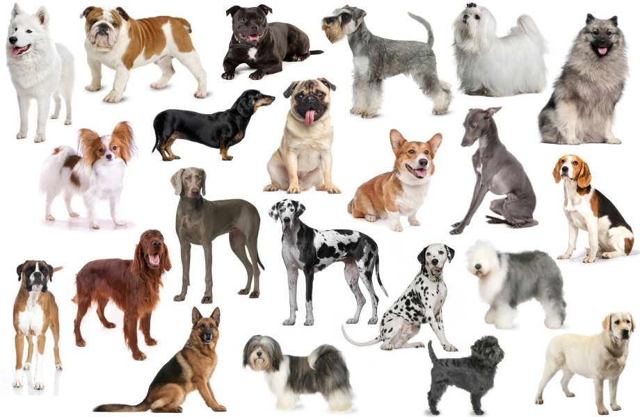

# The-Pup-Files

### 1.1 Product Overview

The aim of this capstone project was to build a neural-network classifier model that classifies a dog's breed based on the image fed to the model. There are 3 main features implemented:

  * #### 1.1.1 Machine Learning
    The algorithm used to build the model was Convolutional Neural Networks with 16,000+ images used for training and 120 breeds used as labels for classification. Training accuracy of 79% was achieved with training done on 25 epochs.
  
  * #### 1.1.2 Metadata Visualization
    Apart from building the classifier, we also provided visualizations using the metadata. These include a map that visualizes where each dog breed originates from and a pie chart that illustrates how many dog breeds hail from each country.
  
  * #### 1.1.3 Flask Application
    A flask application with was constructed which used the model on the backend for testing. Routes for metadata visualization were also included.
  
### 1.2 Data Source

Data was gathered from the Stanford Dogs Dataset (http://vision.stanford.edu/aditya86/ImageNetDogs/) which contained 20,000+ images for 120 dog breeds that were built using images and annotations from ImageNet (http://www.image-net.org/) for the task of fine-grained image categorization

### 1.3 Technology Stack
  * Python
  * Pandas
  * Numpy
  * Jupyter Notebook
  * Keras
  * Tensorflow
  * Plotly.js
  * Leaflet.js
  * Flask 
  
### 1.4 Project Roles
  * Krithika Raghavendran - ML/Data Viz
  * Wilson Mendez - ML/Flask
  * Seth Porter - Flask/HTML/CSS
